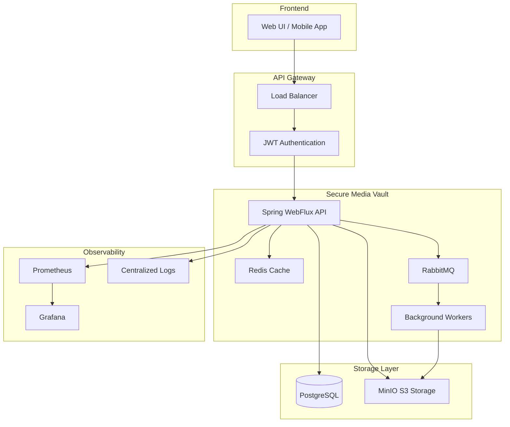

# 🔐 Secure Media Vault

[](https://github.com/jackby03/secure-media-vault/actions/workflows/ci.yml)
[](https://github.com/jackby03/secure-media-vault/actions/workflows/security.yml)
[](https://github.com/jackby03/secure-media-vault/actions/workflows/docker.yml)
[](https://opensource.org/licenses/MIT)
[](https://spring.io/projects/spring-boot)
[](https://kotlinlang.org/)

> **Una plataforma segura y escalable para la gestión de archivos multimedia con autenticación avanzada, almacenamiento distribuido y observabilidad completa.**

---

## 📋 Tabla de Contenidos

- [🎯 Características Principales](#-características-principales)
- [🏗️ Arquitectura](#️-arquitectura)
- [🚀 Inicio Rápido](#-inicio-rápido)
- [📦 Tecnologías](#-tecnologías)
- [🔧 Configuración](#-configuración)
- [📊 Observabilidad](#-observabilidad)
- [🧪 Testing](#-testing)
- [🚀 Despliegue](#-despliegue)
- [📚 API Documentation](#-api-documentation)
- [🤝 Contribución](#-contribución)
- [📄 Licencia](#-licencia)

---

## 🎯 Características Principales

### 🔒 **Seguridad Avanzada**
- **Autenticación JWT** con tokens de acceso y refresh
- **Autorización basada en roles** (ADMIN, EDITOR, VIEWER)
- **Validación de archivos** por tipo y tamaño
- **Encriptación en tránsito** con HTTPS/TLS
- **Análisis de vulnerabilidades** automatizado

### 📁 **Gestión de Archivos**
- **Upload seguro** de múltiples formatos de archivo
- **Procesamiento asíncrono** con RabbitMQ
- **Almacenamiento distribuido** con MinIO S3-compatible
- **Metadatos enriquecidos** y búsqueda avanzada
- **URLs de descarga temporal** con expiración

### ⚡ **Rendimiento & Escalabilidad**
- **Arquitectura reactiva** con Spring WebFlux
- **Caché inteligente** con Redis
- **Pool de conexiones** optimizado R2DBC
- **Procesamiento en background** no bloqueante
- **Métricas de rendimiento** en tiempo real

### 📊 **Observabilidad Completa**
- **Métricas Prometheus** integradas
- **Dashboards Grafana** personalizados
- **Health checks** detallados
- **Logging estructurado** con correlation IDs
- **Alertas proactivas** configurables

---

## 🏗️ Arquitectura



### 🎯 **Patrones de Diseño Implementados**
- **Hexagonal Architecture** (Ports & Adapters)
- **CQRS** para separación de comandos y consultas
- **Event-Driven Architecture** con mensajería asíncrona
- **Repository Pattern** con abstracción de datos
- **Circuit Breaker** para resiliencia

---

## 🚀 Inicio Rápido

### 📋 **Prerequisitos**

- **Docker** 24.0+ y **Docker Compose** 2.0+
- **Java JDK** 21+ (para desarrollo local)
- **Gradle** 8.0+ (incluido wrapper)
- **Git** para control de versiones

### ⚡ **Instalación Rápida**

```bash
# 1. Clonar el repositorio
git clone https://github.com/jackby03/secure-media-vault.git
cd secure-media-vault

# 2. Configurar variables de entorno
cp .env.sample .env
# Editar .env con tus configuraciones

# 3. Levantar la infraestructura completa
docker-compose up -d

# 4. Verificar que todo esté funcionando
curl http://localhost:8080/actuator/health
```

### 🌐 **Acceso a Servicios**

| Servicio | URL                              | Credenciales               |
|----------|----------------------------------|----------------------------|
| **API** | http://localhost:8080/auth/login | admin@vault.com / admin123 |
| **Grafana** | http://localhost:3000            | admin / admin              |
| **MinIO Console** | http://localhost:9001            | minioadmin / minioadmin    |
| **RabbitMQ** | http://localhost:15672           | guest / guest              |

---

## 📦 Tecnologías

### 🚀 **Backend Stack**
```kotlin
// Core Framework
Spring Boot 3.5.5
Spring WebFlux (Reactive)
Kotlin 1.9.25
Java 21 LTS

// Database & Caching
PostgreSQL 15
R2DBC (Reactive Database)
Redis 7 (Caching)
Flyway (Migrations)

// Messaging & Storage
RabbitMQ 3.12
MinIO (S3-compatible)
Jackson (JSON Processing)

// Security & Validation
Spring Security 6
JWT Authentication
Bean Validation
```

### 📊 **Observabilidad & DevOps**
```yaml
# Monitoring
Prometheus: métricas y alertas
Grafana: dashboards y visualización
Micrometer: instrumentación de métricas

# CI/CD
GitHub Actions: pipelines automatizados
Docker: containerización
Gradle: build y gestión de dependencias
Dependabot: actualizaciones automáticas

# Testing
JUnit 5: testing framework
MockK: mocking para Kotlin
Testcontainers: testing de integración
```

---

## 🔧 Configuración

### 🌍 **Variables de Entorno**

```bash
# Database Configuration
SPRING_DATASOURCE_URL=r2dbc:postgresql://db:5432/management
SPRING_DATASOURCE_USERNAME=postgres
SPRING_DATASOURCE_PASSWORD=your_secure_password

# Redis Configuration
SPRING_REDIS_HOST=redis
SPRING_REDIS_PORT=6379

# MinIO Configuration
MINIO_ENDPOINT=http://minio:9000
MINIO_ACCESS_KEY=your_access_key
MINIO_SECRET_KEY=your_secret_key

# JWT Configuration
JWT_SECRET_KEY=your_super_secret_jwt_key_here
JWT_ACCESS_TOKEN_EXPIRATION=3600000
JWT_REFRESH_TOKEN_EXPIRATION=86400000

# RabbitMQ Configuration
SPRING_RABBITMQ_HOST=rabbitmq
SPRING_RABBITMQ_USERNAME=guest
SPRING_RABBITMQ_PASSWORD=guest
```

### ⚙️ **Configuración de Profiles**

```yaml
# application-development.yml
spring:
  profiles: development
  logging:
    level:
      com.acme.vault: DEBUG
  r2dbc:
    pool:
      max-size: 5

# application-production.yml  
spring:
  profiles: production
  logging:
    level:
      root: WARN
      com.acme.vault: INFO
  r2dbc:
    pool:
      max-size: 20
```

---

## 📊 Observabilidad

### 📈 **Métricas Disponibles**

```prometheus
# Business Metrics
vault_files_uploaded_total
vault_files_processed_total
vault_file_processing_duration_seconds
vault_storage_usage_bytes

# Technical Metrics
http_server_requests_seconds
jvm_memory_used_bytes
r2dbc_pool_active_connections
redis_commands_processed_total
rabbitmq_queue_messages_total
```

### 📊 **Dashboards Grafana**

- **🏠 Overview Dashboard**: métricas generales del sistema
- **📁 File Operations**: operaciones de archivos y procesamiento
- **🔒 Security Monitoring**: eventos de autenticación y autorización
- **⚡ Performance**: latencia, throughput y recursos
- **📱 HTTP Access Logs**: análisis detallado de requests

### 🚨 **Alertas Configuradas**

- **Alto uso de memoria** (>80%)
- **Latencia elevada** (>2s percentil 95)
- **Errores de autenticación** (>10 por minuto)
- **Fallos de procesamiento** de archivos
- **Espacio de almacenamiento** crítico (>90%)

---

## 🧪 Testing

### 📊 **Cobertura de Tests**

```bash
# Ejecutar todos los tests
./gradlew test

# Tests con cobertura
./gradlew test jacocoTestReport

# Ver reporte de cobertura
open api/build/reports/jacoco/test/html/index.html
```

### 🎯 **Estrategia de Testing**

```kotlin
// Unit Tests (157 tests)
@Test
fun `should validate file metadata correctly`() {
    // Business logic validation
}

// Integration Tests
@SpringBootTest
@Testcontainers
class FileControllerIntegrationTest {
    // Full stack testing with real containers
}

// Performance Tests
@Test
fun `should handle concurrent uploads efficiently`() {
    // Load testing scenarios
}
```

### 📋 **Test Suites**

- **Unit Tests**: 127 tests (Phase 1 complete)
- **Integration Tests**: 30 tests (Phase 2.1 complete)
- **Security Tests**: JWT validation, authorization
- **Performance Tests**: load testing, stress testing

---

## 🚀 Despliegue

### 🐳 **Docker Deployment**

```bash
# Build production image
docker build -f api/Dockerfile -t secure-media-vault:latest .

# Run with production profile
docker run -e SPRING_PROFILES_ACTIVE=production \
  -p 8080:8080 secure-media-vault:latest
```

### ☸️ **Kubernetes Deployment**

```yaml
apiVersion: apps/v1
kind: Deployment
metadata:
  name: secure-media-vault
spec:
  replicas: 3
  selector:
    matchLabels:
      app: secure-media-vault
  template:
    metadata:
      labels:
        app: secure-media-vault
    spec:
      containers:
      - name: api
        image: secure-media-vault:latest
        ports:
        - containerPort: 8080
        env:
        - name: SPRING_PROFILES_ACTIVE
          value: "production"
```

### 🔄 **CI/CD Pipeline**

```yaml
# .github/workflows/ci.yml
name: CI/CD Pipeline
on: [push, pull_request]
jobs:
  test:
    runs-on: ubuntu-latest
    steps:
      - uses: actions/checkout@v4
      - name: Setup JDK 21
        uses: actions/setup-java@v4
      - name: Run Tests
        run: ./gradlew test
      - name: Security Scan
        uses: github/codeql-action/analyze@v3
```

---

## 📚 API Documentation

### 🔐 **Authentication Endpoints**

```http
POST /auth/login
Content-Type: application/json

{
  "email": "user@example.com",
  "password": "securePassword"
}

Response:
{
  "accessToken": "eyJhbGciOiJIUzI1NiIs...",
  "refreshToken": "eyJhbGciOiJIUzI1NiIs...",
  "expiresIn": 3600,
  "tokenType": "Bearer"
}
```

### 📁 **File Management Endpoints**

```http
# Upload File
POST /api/files
Authorization: Bearer {token}
Content-Type: multipart/form-data

# List Files
GET /api/files?page=0&size=20
Authorization: Bearer {token}

# Download File
GET /api/files/{id}/download
Authorization: Bearer {token}

# Search Files
GET /api/files/search?query=document&page=0&size=10
Authorization: Bearer {token}
```

### 👥 **User Management Endpoints**

```http
# Create User (Admin only)
POST /api/users
Authorization: Bearer {admin_token}
Content-Type: application/json

{
  "name": "John Doe",
  "email": "john@example.com",
  "role": "EDITOR"
}

# List Users
GET /api/users
Authorization: Bearer {token}
```

### 📊 **Health & Monitoring**

```http
# Basic Health Check
GET /actuator/health

# Detailed Health (Admin only)
GET /api/health/detailed
Authorization: Bearer {admin_token}

# Metrics (Prometheus format)
GET /actuator/prometheus

# Application Info
GET /actuator/info
```

---

## 🤝 Contribución

### 📝 **Proceso de Contribución**

1. **Fork** el repositorio
2. **Crear** una rama feature (`git checkout -b feature/amazing-feature`)
3. **Commit** los cambios (`git commit -m 'Add amazing feature'`)
4. **Push** a la rama (`git push origin feature/amazing-feature`)
5. **Abrir** un Pull Request

### 🎯 **Guidelines de Desarrollo**

```kotlin
// Code Style
- Kotlin coding conventions
- Meaningful variable names
- Comprehensive documentation
- Unit tests for all business logic

// Commit Messages
feat: add new file encryption feature
fix: resolve authentication timeout issue
docs: update API documentation
test: add integration tests for file upload
```

### 🐛 **Reportar Issues**

Utiliza nuestras plantillas de issues:
- **🐛 Bug Report**: para reportar errores
- **✨ Feature Request**: para solicitar nuevas funcionalidades  
- **🔒 Security Report**: para vulnerabilidades de seguridad
- **📚 Documentation**: para mejoras de documentación

---

## 📈 Roadmap

### 🎯 **Phase 1** ✅ *Completado*
- [x] Arquitectura base y configuración
- [x] Autenticación JWT y autorización
- [x] Upload y gestión básica de archivos
- [x] Testing suite (127 tests)

### 🎯 **Phase 2** ⏳ *En Progreso*
- [x] Observabilidad completa (Grafana + Prometheus)
- [x] CI/CD pipeline automatizado
- [ ] Testing avanzado (TokenService, CacheService, MinioService)
- [ ] Optimizaciones de rendimiento

### 🎯 **Phase 3** 📋 *Planificado*
- [ ] Interface web React/Vue.js
- [ ] API GraphQL adicional
- [ ] Procesamiento de imágenes automático
- [ ] Integración con servicios de ML

### 🎯 **Phase 4** 🔮 *Futuro*
- [ ] Multi-tenancy support
- [ ] Advanced analytics dashboard
- [ ] Mobile apps (iOS/Android)
- [ ] Blockchain integrity verification

---

## 🏆 Reconocimientos

### 👏 **Contributors**

- **@jackby03** - Project Lead & Backend Developer
- **Security Team** - Security reviews and penetration testing
- **DevOps Team** - Infrastructure and deployment automation

### 🛠️ **Built With**

Este proyecto ha sido construido utilizando las mejores prácticas de la industria y tecnologías de vanguardia, siguiendo principios de:

- **Clean Architecture**
- **Test-Driven Development (TDD)**
- **Continuous Integration/Continuous Deployment (CI/CD)**
- **Security by Design**
- **Observability First**

---

## 📄 Licencia

Este proyecto está licenciado bajo la MIT License - ver el archivo [LICENSE](LICENSE) para más detalles.

```
MIT License

Copyright (c) 2025 Secure Media Vault Project

Permission is hereby granted, free of charge, to any person obtaining a copy
of this software and associated documentation files (the "Software"), to deal
in the Software without restriction, including without limitation the rights
to use, copy, modify, merge, publish, distribute, sublicense, and/or sell
copies of the Software, and to permit persons to whom the Software is
furnished to do so, subject to the following conditions:

The above copyright notice and this permission notice shall be included in all
copies or substantial portions of the Software.
```

---

## 📞 Contacto & Soporte

### 💬 **Canales de Comunicación**

- **📧 Email**: support@secure-media-vault.com
- **💬 Discussions**: [GitHub Discussions](https://github.com/jackby03/secure-media-vault/discussions)
- **🐛 Issues**: [GitHub Issues](https://github.com/jackby03/secure-media-vault/issues)
- **🔒 Security**: security@secure-media-vault.com

### 📖 **Recursos Adicionales**

- **📘 Wiki**: [Documentación técnica detallada](https://github.com/jackby03/secure-media-vault/wiki)
- **🎥 Tutorials**: [Video tutorials y demos](https://youtube.com/secure-media-vault)
- **📊 Status Page**: [System status y uptime](https://status.secure-media-vault.com)

---

<div align="center">

**⭐ Si este proyecto te ha sido útil, ¡no olvides darle una estrella! ⭐**

[](https://github.com/jackby03/secure-media-vault/stargazers)
[](https://github.com/jackby03/secure-media-vault/network/members)

Made with ❤️ by the Secure Media Vault Team

</div>
